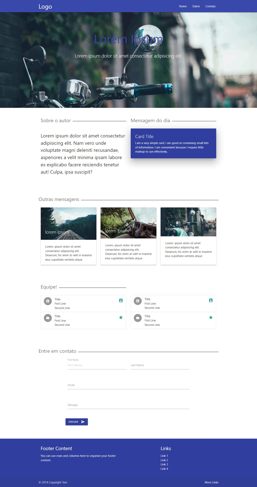

# Projeto Materialize

## Sobre

Esse projeto foi feito com o materialize para praticar e aprender a usar esse framework.

## Características

- [x] framework materialize
- [x] Responsivo

## Tecnologias usadas

- [HTML]
- [CSS]
- [Materialize]

### Tela

<h2>
  
</h2>

---

Feito por Jackson Gravino
